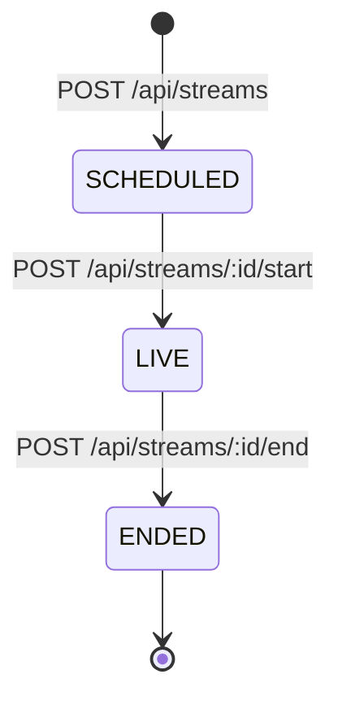
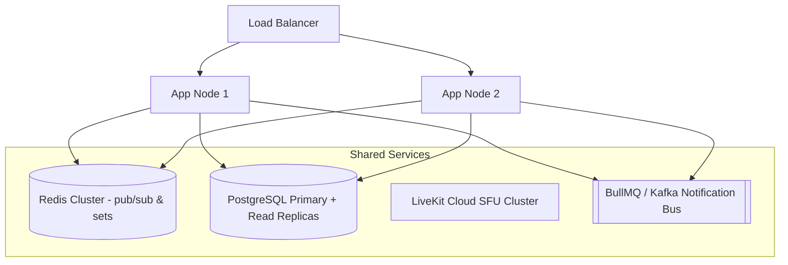

# System Architecture & Design Choices

This document outlines the core architectural paradigms, system design considerations, and data structures implemented in the **LiveCast** real-time broadcasting and interactive chat application.

---

## 🏗️ System Component Map

```mermaid
graph TD
    subgraph Mobile Client (React Native + Expo)
        UI[User Interface]
        Zustand[Zustand Auth Store]
        Outbox[MMKV Offline Outbox]
        NetInfo[NetInfo Listener]
    end

    subgraph Backend Services (Node.js + Express)
        API[Express Router]
        Socket[Socket.IO Server]
        LKService[LiveKit Token & Room Service]
        ChatService[Chat Persistence Service]
    end

    subgraph Infrastructure
        Postgres[(PostgreSQL DB)]
        Redis[(Redis Key-Value Cache)]
        LKCloud[LiveKit WebRTC Cloud/Docker]
    end

    UI --> API
    UI --> Socket
    NetInfo --> Outbox
    Outbox --> API
    API --> LKService
    API --> ChatService
    LKService --> LKCloud
    ChatService --> Postgres
    Socket --> Redis
    API --> Postgres
```

---

## 🔒 1. Isolation Strategy (Streams, Chat & Viewers)

To ensure high-concurrency safety and guarantee that activities on **Stream A** never leak into **Stream B**, isolation is applied across three distinct layers:

### A. LiveKit Audio/Video Rooms
- Rooms are named deterministically using the database record identifier prefix and creator id: `stream_${creatorId_prefix}_${timestamp}`.
- WebRTC media routing is entirely managed and isolated at the SFU (Selective Forwarding Unit) layer using these unique room keys.

### B. Socket.io Chat Rooms
- Every viewer client joins a specific Socket.io room matching the database `streamId` UUID:
  ```typescript
  socket.join(streamId);
  ```
- Chat message payloads are strictly scoped. Incoming messages on socket listener `chat:message` are saved to the database and broadcasted exclusively to that socket room:
  ```typescript
  io.to(streamId).emit("chat:new_message", savedMessage);
  ```

### C. Redis Viewer Presence Set
- Simple counters (such as `INCR`/`DECR`) are subject to drift, synchronization slips, and negative counts if clients fail to disconnect cleanly.
- Instead, client presence is tracked using **Redis Sets** unique to each stream: `viewers:${streamId}`.
- Joining a stream issues an atomic `SADD` using the viewer's authenticated `userId`.
- Leaving a stream issues an atomic `SREM`.
- Querying active viewer count calls `SCARD`, returning the cardinality of distinct active users in $O(1)$ time complexity. This guarantees:
  - **Idempotency:** A client joining multiple times (e.g. page refreshes, reconnection loops) does not double-count.
  - **Safety:** The count can never drop below zero.

---

## ⚙️ 2. Lifecycle State Machine

A stream's status is governed by a strict, unidirectional state machine:



- **`SCHEDULED`**: The stream metadata is registered in the database. No token is generated, and the WebRTC media room is not yet initialized.
- **`LIVE`**: The creator starts broadcasting. The LiveKit media room is initialized, the Redis viewer cache is set up, and the creator receives their publisher token.
- **`ENDED`**: The stream is finalized. The final peak viewer count is computed, all remaining participants are forced out of the LiveKit room, and the Redis keys are cleaned up. 

*Illegal transitions (e.g., trying to join an `ENDED` stream, starting an already `LIVE` stream, or ending a `SCHEDULED` stream directly) are rejected with a `409 Conflict` state validation error.*

---

## 🛡️ 3. Idempotency & Offline Synchronization

### A. The Client-Side Outbox (MMKV)
When a user is offline (detected via the `@react-native-community/netinfo` event hook), their messages are queued locally in **MMKV** storage:
```json
{
  "streamId": "uuid-here",
  "content": "Hello World!",
  "clientMessageId": "uuid-v4-generated-on-client",
  "clientTimestamp": "ISO-string"
}
```

### B. The Batch Sync Gateway
Upon reconnection, the client automatically triggers an exponential backoff loop to push queued messages to the `POST /api/chat/sync` endpoint.

### C. Deduplication Strategy
To safeguard against clock skew, network drops, and duplicate delivery retries (flapping connections), database-level integrity is enforced:
1. `clientMessageId` is set as a `@unique` index on the `ChatMessage` model in PostgreSQL.
2. The sync service checks for existing records matching `clientMessageId` before executing any insert:
   ```typescript
   const existing = await prisma.chatMessage.findUnique({
     where: { clientMessageId }
   });
   if (existing) return existing; // Skip insert, return successfully
   ```
3. This ensures that even if a batch payload of 50 offline messages is retried 5 times due to packet loss, **exactly 50 messages** will exist in the database without duplicates.

---

## 📈 4. Scaling This to Production (10k+ Concurrent Viewers)

While this architecture is optimized for single-node efficiency during the development phase, scaling to production requires resolving three primary bottlenecks:



1. **Distributed Socket.io:**
   - **Problem:** If Node instance A has connections for Stream A, and Node instance B receives a new chat message, viewers connected to instance A won't see it.
   - **Solution:** Add `@socket.io/redis-adapter` to distribute room messages across instances via Redis pub/sub.
2. **Database Read/Write Spikes:**
   - **Problem:** 10,000 users sending chat messages concurrently will exhaust PostgreSQL connection pools.
   - **Solution:** Introduce connection pooling (e.g. PgBouncer), utilize read replicas for browse/discover queries, and buffer chat writes into a fast queue (e.g. BullMQ/Kafka) for bulk writing to PostgreSQL.
3. **Decoupled Notification & Webhook Queueing:**
   - **Problem:** Firing webhooks directly inside the request-response thread slows down execution and triggers timeouts.
   - **Solution:** Publish events to BullMQ/Kafka immediately, processing notification webhooks, trend analyses, and highlight summaries asynchronously background workers.
