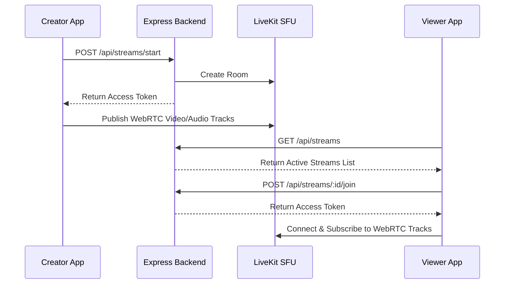
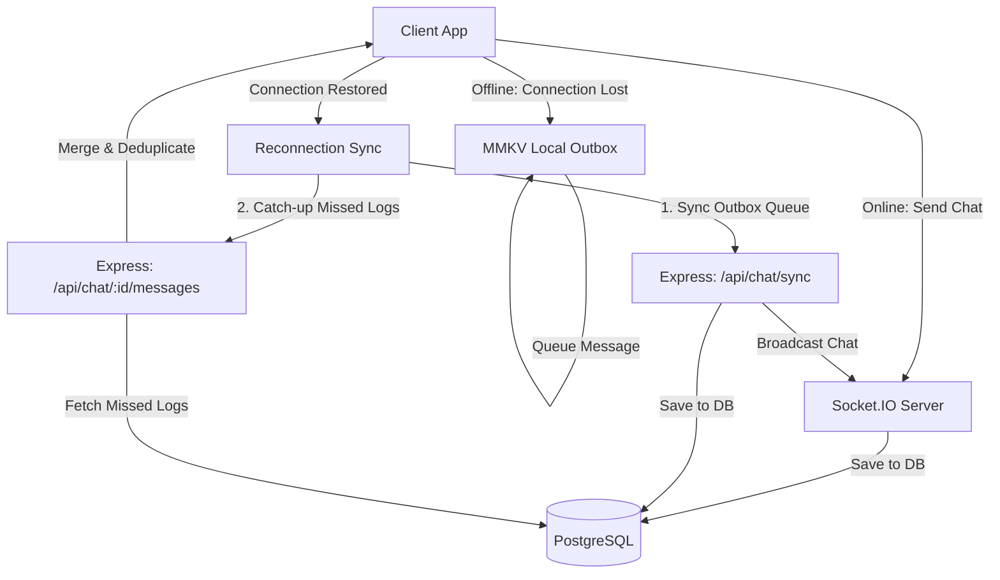
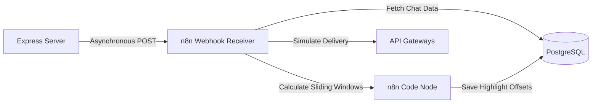

# LiveCast: Real-Time Live Event Broadcasting System

LiveCast is a live streaming platform where creators broadcast media, viewers watch with interactive real-time chat, and an asynchronous automation pipeline manages alerts, digests, and analytics.

---

## Technical Stack

### Mobile Client (Frontend)
- **Framework**: Expo (React Native)
- **State Management**: Zustand
- **Local Storage**: MMKV (high-performance key-value store)
- **Network State**: NetInfo
- **WebRTC Client**: livekit-client-sdk
- **Signaling & Chat Client**: socket.io-client

### Server (Backend)
- **Runtime & Language**: Node.js, TypeScript
- **Framework**: Express
- **Database ORM**: Prisma ORM
- **Database Engine**: PostgreSQL
- **Caching & Presence**: Redis (ioredis)
- **WebRTC Service**: LiveKit SFU (Server SDK)
- **Signaling & Chat Server**: Socket.IO

### Automation & Workflows
- **Platform**: n8n Workflow Automation Engine
- **Deployment**: Docker Compose

---

## Project Structure

```
buildai/
├── docker-compose.yml              # PostgreSQL, Redis, and n8n services
├── README.md                       # System documentation
├── ARCHITECTURE.md                 # Detailed design documentation
├── backend/                        # Backend Server Directory
│   ├── prisma/
│   │   ├── schema.prisma           # Prisma database schemas
│   │   └── migrations/             # Safe database migration SQL history
│   ├── src/
│   │   ├── config/                 # Redis and Prisma client configurations
│   │   ├── middleware/             # JWT authentication middleware
│   │   ├── routes/                 # Express REST endpoint routers
│   │   ├── services/               # Core business logic (streams, chat)
│   │   ├── socket/                 # Socket.IO event handlers
│   │   ├── utils/                  # n8n webhook HTTP helper client
│   │   └── index.ts                # App entry point & Socket server initialization
│   └── package.json
├── mobile/                         # Mobile Application Directory
│   ├── App.tsx                     # Onboarding navigation, layouts, and global toast managers
│   ├── screens/                    # React Native UI screens
│   │   ├── WelcomeScreen.tsx       # Onboarding splash screen
│   │   ├── BrowseScreen.tsx        # Home/Viewer feed dashboard
│   │   ├── ViewerLiveScreen.tsx    # Live watch stream player and chat room
│   │   ├── CreatorDashboardScreen.tsx # Studio dashboard, analytics modal, follower management
│   │   ├── CreatorScreen.tsx       # Live broadcasting interface
│   │   ├── ProfileScreen.tsx       # Viewer settings and followers list
│   │   ├── AlertsScreen.tsx        # System notification feed
│   │   └── AutomationsScreen.tsx   # n8n workflows controller panel
│   ├── hooks/                      # Custom React hooks (useChat state manager)
│   ├── services/                   # REST API client, Socket instance, MMKV storage managers
│   └── package.json
└── n8n-workflows/                  # Workflow Configurations Directory
    ├── daily-digest.json           # 24h cron-digest generator
    ├── stream-start-notification.json # Start event follower notifier
    ├── stream-end-highlights.json  # Sliding-window highlights analyzer
    └── viewer-milestone-alert.json # Milestone listener and creator alert
```

---

## Architectural Approach

### 1. WebRTC Media Delivery Pipeline
The creator pushes WebRTC media to the LiveKit SFU. Viewers fetch WebRTC tracks dynamically to watch the broadcast.



### 2. Chat Synchronization and Reconnect Recovery
Real-time chat is routed through Socket.IO. When connection drops, messages queue in MMKV locally. Upon reconnection, missed history is caught up via REST while pending local messages sync in batch.



### 3. Asynchronous Automation Pipeline (n8n Webhook Architecture)
Database modifications and stream events trigger lightweight HTTP post requests asynchronously to n8n webhooks.



---

## Implemented Features

### Phase 1: Real-Time Live Broadcasting
- **Start/End Broadcast**: Creators allocate LiveKit WebRTC rooms and publish media. Ending a stream cleans up resources.
- **Browse & Join**: Viewers browse active live broadcasts, connect, and watch media via LiveKit players.
- **Deduplicated Viewer Counting**: Redis sets track active viewer IDs. `SCARD` computes concurrent peaks in O(1) time. Updates broadcast instantly via Socket.IO.
- **Live Chat**: Synced room chats with Express rate limiters capping transmission speeds to 5 messages/second.

### Phase 2: Offline Resilience
- **Network State Toasts**: Floating toasts overlay on connection status changes (displays "Connection Lost: You are offline" and "Connection Restored: Back Online").
- **Offline Outbox**: When offline, chat messages store locally in MMKV database fields with UUID markers, displaying a pending badge.
- **Exponential Backoff Sync**: Reconnection triggers outbox synchronization. Synced messages upload in batches via `/api/chat/sync` with retries scaling from 1s to 16s.
- **Catch-up Sync**: Reconnection requests all missed chat logs from the backend via timestamp filtering, merging, and chronologically sorting them.

### Phase 3: Asynchronous n8n Automations
- **Stream Started**: Toggling live streams fires webhook triggers alerting n8n to send follower notifications.
- **Viewer Milestones**: Crossings thresholds (3, 50, 100, 500, 1000) trigger creator alert feeds. Redis flags enforce exactly-once execution.
- **Highlights Generation**: Terminating streams starts a sliding-window algorithm checking message density:
  $$\text{Window: } [T_i - 15\text{s}, T_i + 15\text{s}]$$
  Saves peak timestamps to database highlight tables as relative offsets (seconds from start).
- **Daily Digest**: A cron job executing daily at 5:00 AM compiles the top 10 streams by peak viewer counts.

---

## Infrastructure Installation and Setup

### 1. Spin up Docker Infrastructure
Launch PostgreSQL, Redis, and n8n:
```bash
docker compose up -d
```
*Verify PostgreSQL is running on port 5432, Redis on 6379, and n8n on 5678.*

### 2. Configure Backend Server
```bash
cd backend
npm install
npx prisma db push
npm run dev
```
*The Express server initializes at http://localhost:3001.*

### 3. Launch Mobile Client
```bash
cd mobile
npm install
npm run start
```
*Press `i` for iOS Simulator or `a` for Android Emulator.*

---

## Testing Verification Procedures

### Testing n8n Automations
1. Open n8n at `http://localhost:5678`.
2. Add a PostgreSQL connection credential named **`Postgres Database Connection`** with host set to `host.docker.internal` (Port: `5432`, DB: `buildai`, User: `postgres`, Password: `postgres`).
3. Import the JSON workflows from the `/n8n-workflows` directory. Activate all workflows.
4. **Stream Start Notification**: Start a broadcast as User A. Verify `stream-start-notification` runs in n8n. Check User B's alerts feed for the notifications.
5. **Viewer Milestones**: Connect 3 viewers to a live stream. Verify the n8n execution log triggers a milestone alert. Creator receives the alert notification.
6. **Highlights Generation**: Send several chats during a broadcast. End the broadcast. Verify the n8n logs process sliding windows and write highlight rows to Postgres. Verify statistics reflect the peaks in the dashboard.

### Testing Offline Resiliency
1. Disconnect Wi-Fi on the simulator or test device.
2. Verify the red floating toast `"Connection Lost: You are offline"` appears.
3. Send chat messages. Verify they display "pending" status and store in MMKV outbox.
4. Reconnect Wi-Fi.
5. Verify the green toast `"Connection Restored: Back Online"` displays.
6. Verify the pending messages synchronize to the server and broadcast to other users.
