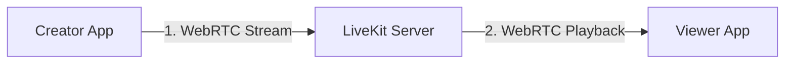
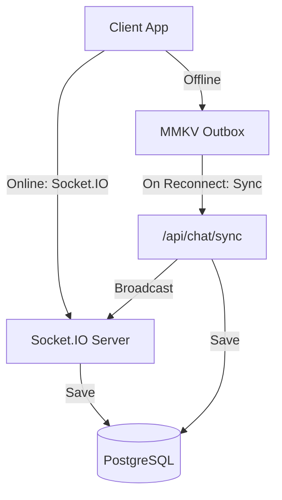
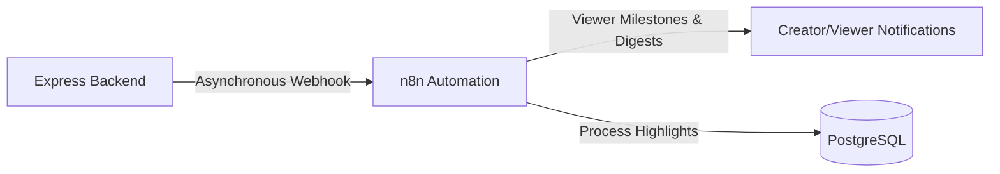

# LiveCast: Real-Time Live Event Broadcasting

LiveCast is a live streaming platform where creators broadcast media, viewers watch with real-time chat, and an automation pipeline manages alerts, digests, and analytics.

---

## Technical Stack

| Layer | Technology |
|---|---|
| **Mobile Framework** | React Native + Expo SDK |
| **Navigation** | Expo Router (file-based) |
| **State Management** | Zustand |
| **Local Storage** | MMKV (high-performance caching) |
| **Network State** | NetInfo |
| **Streaming Engine** | LiveKit SFU (WebRTC Client & Server SDKs) |
| **Real-time Signaling / Chat** | Socket.IO |
| **Backend Framework** | Node.js + Express (TypeScript) |
| **Database ORM** | Prisma |
| **Database Engine** | PostgreSQL |
| **Caching & Presence** | Redis |
| **Automation** | n8n Engine |

---

## Project Focus & System Flow

Development focus was primarily placed on establishing a robust, production-grade foundation for **Phase 1 (Real-Time Live Broadcasting)** and **Phase 2 (Offline Resilience)** to ensure low-latency media delivery and state synchronization under volatile network connectivity. **Phase 3 (n8n Automations)** was built as an extended value-add to orchestrate asynchronous workflows.

### System Architecture by Phase

#### Phase 1: Live Video Flow (WebRTC Broadcasting)


#### Phase 2: Real-Time Chat & Reconnection Flow


#### Phase 3: Asynchronous n8n Automations Flow


---

## Implemented Features

### Phase 1: Real-Time Live Broadcasting (Core Priority)
- [x] **Stream State Machine**: Enforces a strict `SCHEDULED` → `LIVE` → `ENDED` stream lifecycle on the backend, with validation guards preventing double-start or illegal transition errors.
- [x] **WebRTC Audio/Video Streaming**: Secure integration with LiveKit SFU. Backend generates JWT tokens with publishing privileges for creators (`canPublish: true`) and watching privileges for viewers (`canSubscribe: true`).
- [x] **Real-Time Synchronized Chat**: Fast room-based communication channel via Socket.IO, complete with content validation, length caps (500 chars), and a Redis rate limiter (max 3 messages/5 sec) to block spammers.
- [x] **Deduplicated Viewer Presence**: Tracks concurrent viewer counts in Redis Sets (`SADD`/`SREM`) using `SCARD` in $O(1)$ time, broadcasting updates instantly. Excludes creators from their own stream viewer count.

### Phase 2: Offline Resilience (Core Priority)
- [x] **Network State Toasts**: Floating visual banners displaying immediate connection state changes (red `Connection Lost: You are offline` and green `Connection Restored: Back Online`).
- [x] **JSI-backed Offline Outbox**: Offline chat messages are queued locally in MMKV storage with a pending status.
- [x] **Exponential Backoff Sync**: Upon reconnection, queued outbox messages are batch-synchronized via POST `/api/chat/sync` with automated backoff retry periods scaling from 1s to 16s.
- [x] **Idempotency & Deduplication**: Database level deduplication via client-side message IDs. Single batch-query existence checks protect against double insertions on overlapping sync retries.
- [x] **Reconnection Catch-up**: Pulls missed messages from the database since the last known message timestamp, merging them chronologically and deduplicating.

### Phase 3: Asynchronous n8n Automations (Extended Feature)
- [x] **Stream Start Alerts**: Triggers n8n webhooks to dispatch event alerts to all followers of a creator going live.
- [x] **Viewer Count Milestones**: Evaluates viewer set sizes and alerts creators when passing thresholds (3, 50, 100, 500, 1000). Uses Redis tracking flags to prevent duplicate milestone triggers.
- [x] **Sliding-Window Highlights**: Executes a sliding density calculation ($[T_i - 15\text{s}, T_i + 15\text{s}]$) on stream termination to locate peak chat activity and write highlight offsets to the database.
- [x] **Daily Activity Digest**: Daily 5:00 AM cron workflow compiling the top 10 streams by peak viewers from the past 24 hours.

---

## Project Structure

```
buildai/
├── docker-compose.yml              # Services: Redis and n8n
├── README.md                       # Main documentation
├── backend/                        # Express Backend
│   ├── prisma/schema.prisma        # Prisma database schema
│   └── src/                        # Express Server & Socket.IO logic
├── mobile/                         # React Native Client
│   └── screens/                    # Application screens
└── n8n-workflows/                  # n8n Workflow JSON exports
```

---

## Setup & Running Locally

Because this live-broadcasting application utilizes native WebRTC tracks (`@livekit/react-native`) and high-performance JSI caching (`react-native-mmkv`), it contains native binaries and **cannot** run on the standard Expo Go client app. It must be compiled and built locally on a simulator/emulator or a physical debug device.

### 1. Start Infrastructure
Start the Redis and n8n services:
```bash
docker compose up -d
```

### 2. Run Backend
Initialize the database schema and run the Express server:
```bash
cd backend
npm install
npx prisma db push
npm run dev
```

### 3. Build & Run Mobile App
Install dependencies and build the custom development client binary:
```bash
cd mobile
npm install
```

- **For Android (Emulator/Device)**:
  Make sure an emulator is running or a physical device is connected in debug mode:
  ```bash
  npm run android
  ```
- **For iOS (Mac only, Simulator)**:
  Make sure Xcode and CocoaPods are installed, then run:
  ```bash
  npm run ios
  ```

#### USB Port Forwarding (For physical Android devices)
If running on a physical Android device, run the following `adb` port-reversing commands so your phone can communicate with the local host services:
```bash
adb reverse tcp:8081 tcp:8081   # Metro Packager Port
adb reverse tcp:3001 tcp:3001   # Express Backend Port
```
