# Real-Time Live Event Broadcasting System — System Design

> **BuildableLabs · Wildcard Generalist Engineer · 48-Hour Assignment**

---

## 1. Executive Summary

We're building a mobile live-streaming platform where **creators broadcast video**, **viewers watch with real-time chat**, and **n8n automation handles notifications and analytics**. The system spans three phases: core streaming, offline support, and automation workflows.

This document captures every architectural decision, trade-off, and integration point **before a single line of code is written**.

---

## 2. Technology Stack — Final Recommendations

| Layer | Technology | Rationale |
|:---|:---|:---|
| **Mobile** | React Native (Expo Dev Client) | Cross-platform, fast iteration. Expo Go won't work with LiveKit (requires native modules), so we use `expo-dev-client` for custom dev builds. |
| **Language** | TypeScript (end-to-end) | Type safety across mobile + backend reduces 48-hour bugs. |
| **Backend** | Express.js + TypeScript | Lightweight, massive ecosystem, fast to scaffold. |
| **Database** | PostgreSQL + Prisma ORM | Relational integrity for users/streams/messages. Prisma gives us type-safe queries and instant migrations. |
| **Cache / Pub-Sub** | Redis | In-memory viewer counts, Socket.IO adapter for horizontal scaling, session store. |
| **Real-time Chat** | Socket.IO | Persistent connections, room-based messaging, reconnection handling, Redis adapter for scale. |
| **Video Streaming** | LiveKit Cloud | Managed WebRTC infrastructure. Free tier provides 5,000 minutes — more than enough for a demo. Avoids spending hours on self-hosting. |
| **Offline Storage** | MMKV (via `react-native-mmkv`) | ~30x faster than AsyncStorage via JSI. Perfect for the offline outbox queue. |
| **Automation** | n8n (self-hosted via Docker) | Visual workflow builder, webhook triggers from our backend. |
| **Auth** | JWT (access + refresh tokens) | Simple, stateless, fast to implement. No OAuth complexity for MVP. |

### Stack Challenges & Trade-offs

> [!IMPORTANT]
> **Socket.IO vs LiveKit Data Channels for Chat — Key Decision**
>
> LiveKit has built-in data channels that *could* handle chat, but I recommend **Socket.IO separately** for these reasons:
> 1. **Persistence**: Chat messages need to be stored in PostgreSQL. Socket.IO connects to our backend directly; LiveKit data channels are peer-to-peer and bypass our server.
> 2. **Offline Sync**: Phase 2 requires queuing messages offline and syncing later. This is a backend concern — Socket.IO gives us the server-side hooks to handle this.
> 3. **Decoupling**: If LiveKit has an outage, chat still works. If a viewer hasn't joined the LiveKit room yet (browsing streams), they can still see chat.
> 4. **Room lifecycle**: Socket.IO connections persist across navigation. LiveKit rooms exist only while streaming.
>
> **Trade-off**: Two real-time connections per client (Socket.IO + LiveKit WebRTC). This is standard in production streaming apps (Twitch, YouTube Live all separate chat from video transport).

> [!NOTE]
> **LiveKit Cloud vs Self-Hosted**
>
> For a 48-hour assignment, LiveKit Cloud is the only sane choice. Self-hosting requires domain setup, TLS certificates, TURN server configuration, and Redis coordination — easily 4-6 hours of infrastructure work. The free tier gives us 5,000 WebRTC minutes which is more than enough for demo purposes.

> [!NOTE]
> **Why Redis is Essential (Not Optional)**
>
> You didn't mention Redis, but we need it for:
> - **Viewer counts**: Atomic `INCR`/`DECR` operations — no race conditions
> - **Socket.IO adapter**: Required if we ever run multiple backend instances
> - **Rate limiting**: Protect chat from spam
> - **Ephemeral state**: Online presence, typing indicators

---

## 3. High-Level System Architecture

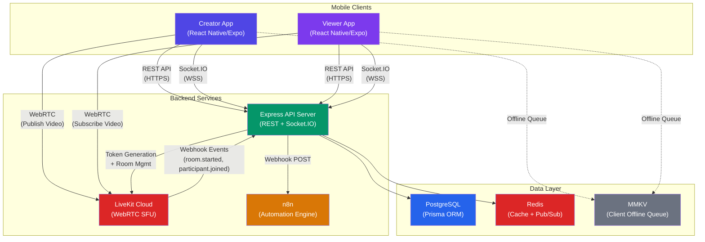

### How Everything Talks to Each Other

| Connection | Protocol | Purpose |
|:---|:---|:---|
| Mobile → API Server | HTTPS (REST) | Auth, stream CRUD, message history, user profiles |
| Mobile ↔ API Server | WSS (Socket.IO) | Real-time chat, viewer count updates, presence |
| Mobile ↔ LiveKit Cloud | WebRTC (UDP) | Video/audio publish (creator) and subscribe (viewer) |
| API Server → LiveKit Cloud | HTTPS (Server SDK) | Generate participant tokens, create/end rooms |
| LiveKit Cloud → API Server | HTTPS (Webhooks) | Room lifecycle events (started, ended, participant joined/left) |
| API Server → n8n | HTTPS (Webhook POST) | Trigger automation workflows |
| API Server ↔ Redis | TCP | Viewer counts, Socket.IO adapter, rate limiting |
| API Server ↔ PostgreSQL | TCP (Prisma) | Persistent data storage |

---

## 4. Component Architecture

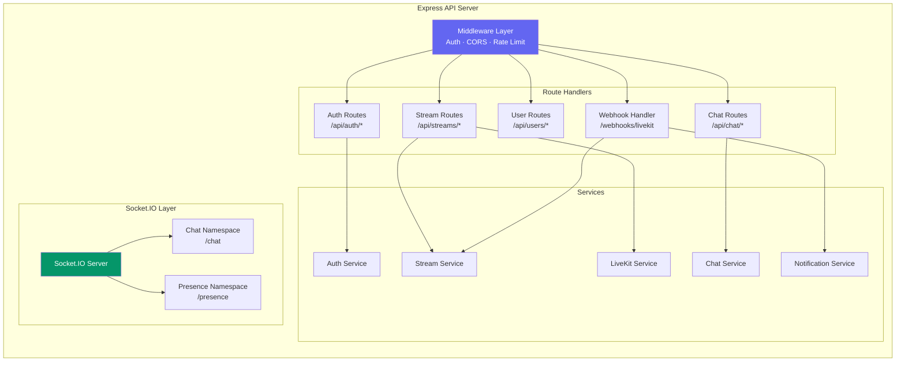

### Service Responsibilities

| Service | Responsibility |
|:---|:---|
| **Auth Service** | JWT token generation/validation, user registration/login, token refresh |
| **Stream Service** | Create/end streams, list active streams, stream metadata, viewer count management |
| **Chat Service** | Message persistence, offline message sync, message history pagination |
| **LiveKit Service** | Generate participant tokens (with correct grants), room management via LiveKit Server SDK |
| **Notification Service** | Fire webhook events to n8n, format notification payloads |

---

## 5. Entity-Relationship Diagram

```mermaid
erDiagram
    USER {
        uuid id PK
        string username UK
        string email UK
        string passwordHash
        string displayName
        string avatarUrl
        boolean isCreator
        timestamp createdAt
        timestamp updatedAt
    }

    STREAM {
        uuid id PK
        uuid creatorId FK
        string title
        string description
        string thumbnailUrl
        enum status "LIVE | ENDED | SCHEDULED"
        string livekitRoomName UK
        int peakViewerCount
        timestamp startedAt
        timestamp endedAt
        timestamp createdAt
    }

    CHAT_MESSAGE {
        uuid id PK
        uuid streamId FK
        uuid userId FK
        string content
        string clientMessageId UK "Idempotency key from client"
        boolean isOfflineSync "Was this sent while offline?"
        timestamp clientTimestamp "Client-side timestamp for ordering"
        timestamp serverTimestamp "Server-side receipt timestamp"
        timestamp createdAt
    }

    FOLLOW {
        uuid id PK
        uuid followerId FK
        uuid followingId FK
        timestamp createdAt
    }

    STREAM_HIGHLIGHT {
        uuid id PK
        uuid streamId FK
        string title
        string summary
        int peakViewers
        int totalMessages
        float durationMinutes
        timestamp createdAt
    }

    USER ||--o{ STREAM : "creates"
    USER ||--o{ CHAT_MESSAGE : "sends"
    STREAM ||--o{ CHAT_MESSAGE : "contains"
    USER ||--o{ FOLLOW : "follows"
    USER ||--o{ FOLLOW : "followed by"
    STREAM ||--o| STREAM_HIGHLIGHT : "generates"
```

### Key Design Decisions in the Schema

1. **`clientMessageId`** (UUID generated on the client): This is the **idempotency key** for offline sync. If a client sends the same message twice (network retry), the server uses this unique constraint to deduplicate.

2. **`clientTimestamp` vs `serverTimestamp`**: Two timestamps solve the offline ordering problem. `clientTimestamp` preserves the user's intended order. `serverTimestamp` records when the server actually received it. The chat UI sorts by `clientTimestamp` but groups offline messages visually.

3. **`isOfflineSync` flag**: Lets us distinguish messages that were queued offline and synced later. Useful for analytics and UI treatment (e.g., showing a subtle "sent while offline" indicator).

4. **`livekitRoomName`**: Unique per stream. We generate this deterministically (e.g., `stream-{streamId}`) so both the backend and clients can derive it independently.

5. **`STREAM_HIGHLIGHT`**: Populated by n8n automation after stream ends. Stores aggregated metrics rather than raw data.

---

## 6. Sequence Diagrams

### 6.1 Creator Starts a Live Stream

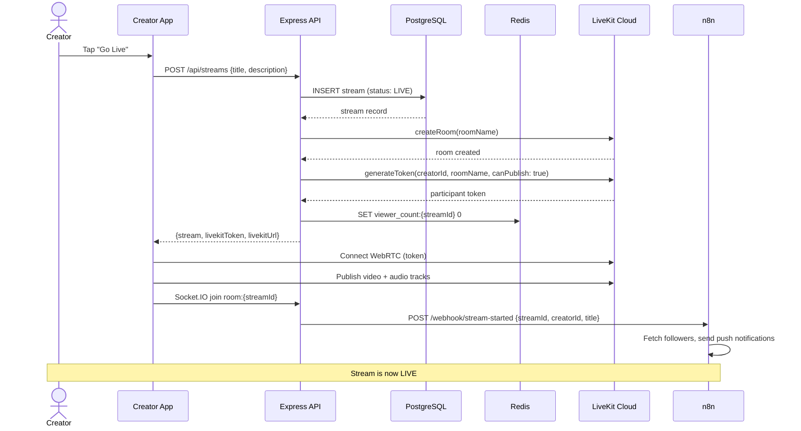

### 6.2 Viewer Joins a Live Stream

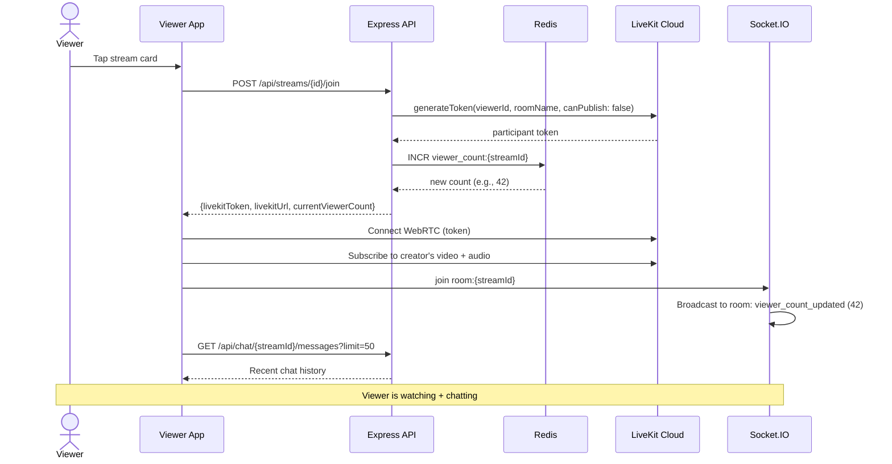

### 6.3 Real-Time Chat Message Flow

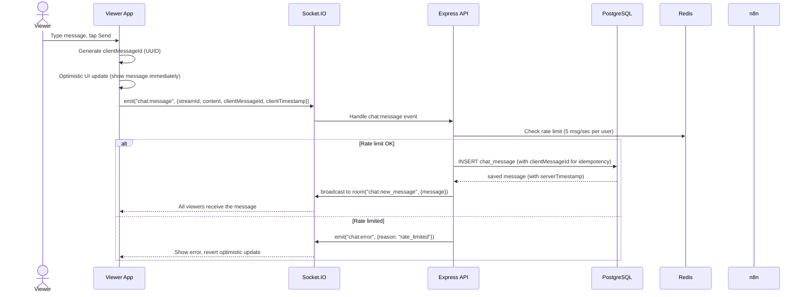

### 6.4 Offline Chat Queue & Sync (Phase 2)

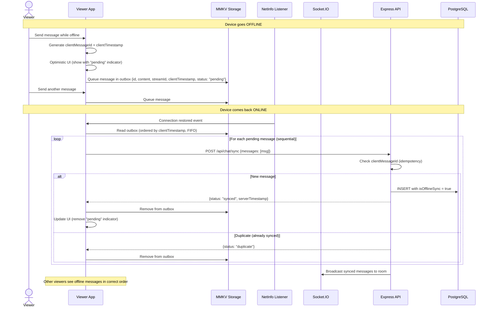

### 6.5 Creator Ends Stream

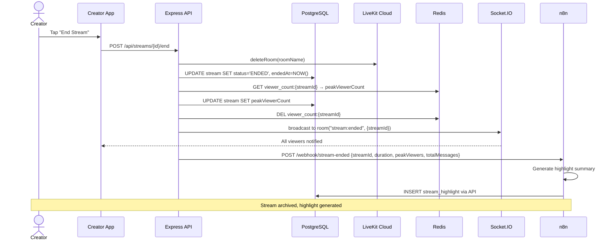

### 6.6 Viewer Count Tracking (Detailed)

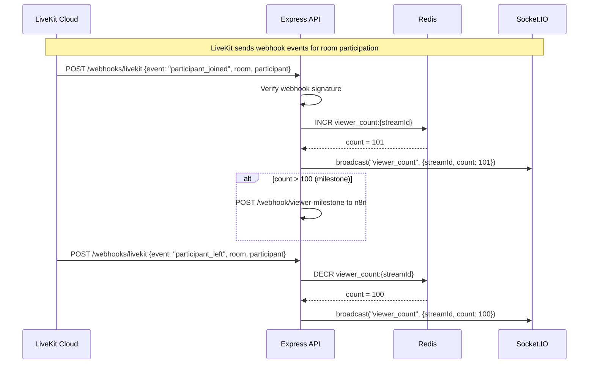

> [!IMPORTANT]
> **Viewer Count Strategy Decision**
>
> We have two options for tracking viewer counts:
>
> **Option A (Recommended): LiveKit Webhooks** — LiveKit sends `participant_joined` and `participant_left` webhook events to our backend. We use Redis `INCR`/`DECR` atomically. This is the most accurate because LiveKit handles the WebRTC connection lifecycle and detects disconnects reliably.
>
> **Option B: Socket.IO connection events** — Track via Socket.IO `connect`/`disconnect` events in each room. Simpler but less reliable — Socket.IO disconnect events can be delayed, and if a user's tab crashes without a clean disconnect, the count drifts.
>
> **Recommendation**: Use **Option A** (LiveKit webhooks) as the source of truth for viewer count, and broadcast the updated count to all clients via Socket.IO. This gives us accuracy from LiveKit's connection management and real-time delivery via Socket.IO.

---

## 7. Mobile App Component Architecture

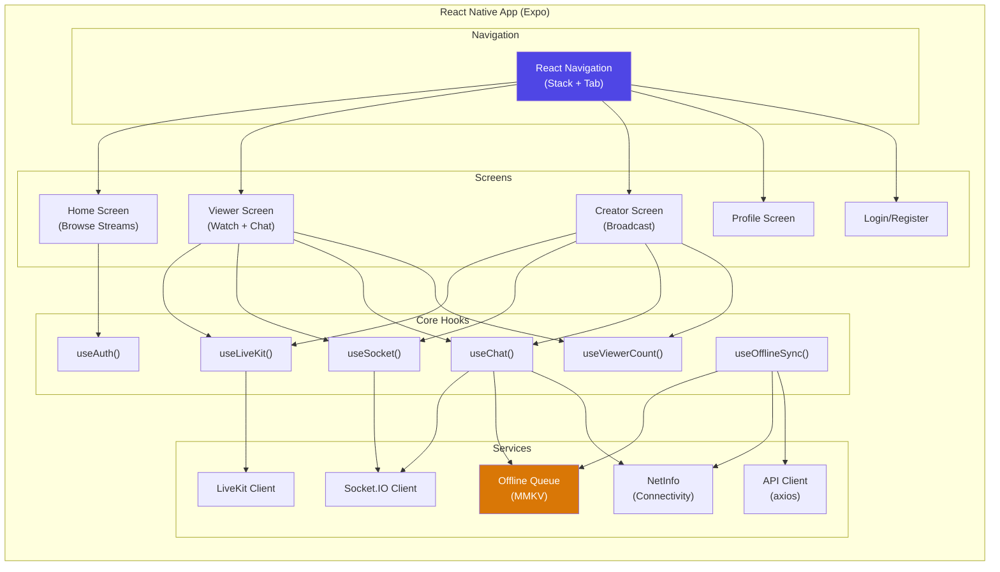

### Key Custom Hooks

| Hook | Responsibility |
|:---|:---|
| `useLiveKit()` | Connect/disconnect from LiveKit room, manage video/audio tracks, handle reconnection |
| `useSocket()` | Manage Socket.IO connection lifecycle, auto-reconnect, auth token attachment |
| `useChat()` | Send messages (online or queue offline), receive messages, load history, handle optimistic UI |
| `useViewerCount()` | Subscribe to viewer count updates via Socket.IO, display current count |
| `useOfflineSync()` | Monitor NetInfo, flush MMKV outbox on reconnect, sequential FIFO processing |
| `useAuth()` | JWT token management, refresh logic, secure storage |

---

## 8. Offline Sync Architecture (Phase 2 — Deep Dive)

### 8.1 Outbox Pattern

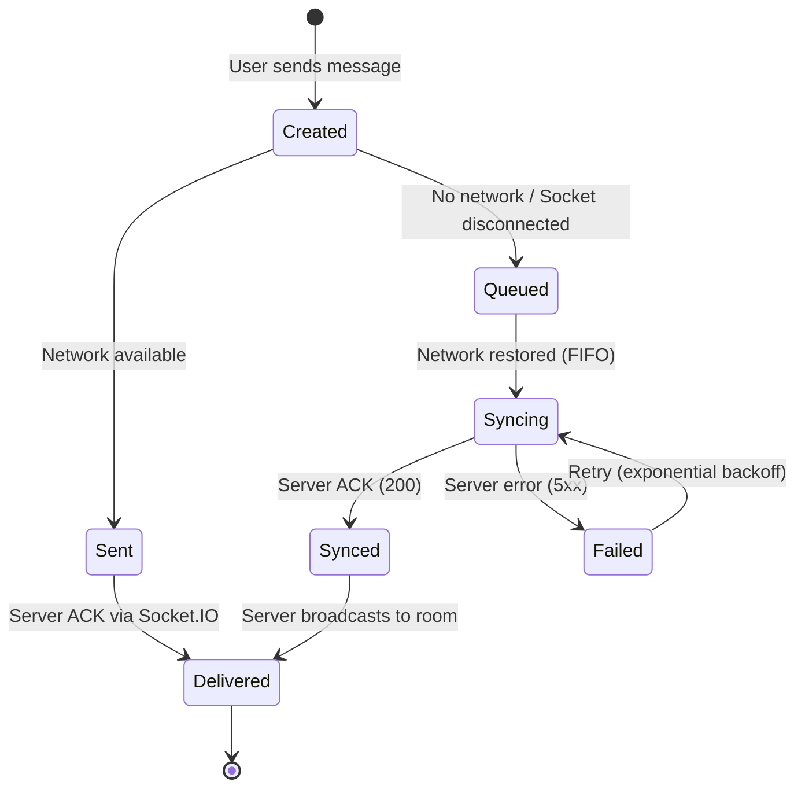

### 8.2 MMKV Outbox Schema

```
Key: "outbox:{streamId}"
Value: JSON array of pending messages

[
  {
    "clientMessageId": "uuid-v4",
    "streamId": "stream-uuid",
    "content": "Hello from offline!",
    "clientTimestamp": "2026-07-02T15:30:00.000Z",
    "status": "pending",         // pending | syncing | failed
    "retryCount": 0,
    "createdAt": "2026-07-02T15:30:00.000Z"
  }
]
```

### 8.3 Conflict Resolution Strategy

| Scenario | Resolution |
|:---|:---|
| **Duplicate message** (same `clientMessageId`) | Server returns `409 Conflict` or `{status: "duplicate"}`. Client removes from outbox. No user-facing error. |
| **Message ordering** (offline msgs arrive late) | Server uses `clientTimestamp` for display ordering. `serverTimestamp` records actual receipt. UI sorts by `clientTimestamp`. |
| **Stream ended while offline** | Server rejects with `410 Gone`. Client removes from outbox and shows "Stream has ended" toast. |
| **User deleted while offline** | Server rejects with `401 Unauthorized`. Client clears outbox and redirects to login. |

### 8.4 Network State Machine

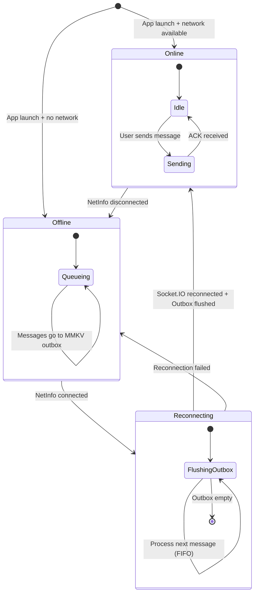

---

## 9. n8n Automation Architecture (Phase 3)

### 9.1 Integration Pattern

The backend fires **one-way webhook POSTs** to n8n. n8n is a consumer of events, not a dependency — if n8n is down, the core platform still works.

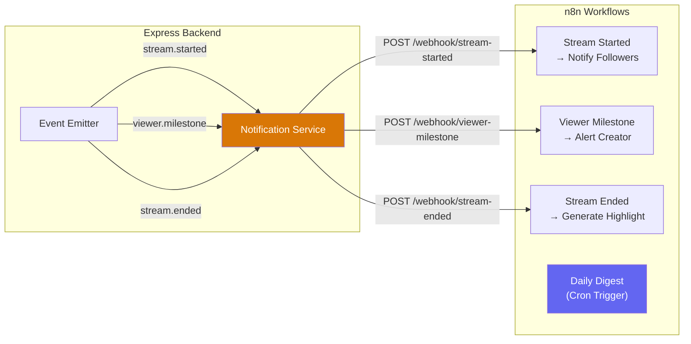

### 9.2 Workflow Definitions

#### Workflow 1: Stream Started → Notify Followers

```
Trigger: Webhook (POST /webhook/stream-started)
Payload: { streamId, creatorId, creatorName, title, thumbnailUrl }

Steps:
1. Webhook Node (receive event)
2. HTTP Request → GET /api/users/{creatorId}/followers (from our API)
3. Split In Batches (process followers in groups of 50)
4. For each follower:
   - Format notification message: "{creatorName} is live: {title}"
   - Send push notification (or log to console for MVP)
5. Respond to webhook with 200 OK
```

#### Workflow 2: Viewer Count Milestone → Alert Creator

```
Trigger: Webhook (POST /webhook/viewer-milestone)
Payload: { streamId, creatorId, currentCount, milestone }

Steps:
1. Webhook Node (receive event)
2. IF node: Check milestone thresholds (100, 500, 1000, etc.)
3. Format congratulatory message
4. HTTP Request → POST to our API (which sends via Socket.IO to creator)
5. Log milestone event
```

#### Workflow 3: Stream Ended → Generate Highlight

```
Trigger: Webhook (POST /webhook/stream-ended)
Payload: { streamId, creatorId, duration, peakViewers, totalMessages }

Steps:
1. Webhook Node (receive event)
2. HTTP Request → GET /api/chat/{streamId}/messages?limit=1000
3. Aggregate stats (message frequency over time, peak chat moments)
4. Generate summary text (could use AI node or template)
5. HTTP Request → POST /api/streams/{streamId}/highlight (save to DB)
6. Respond with 200 OK
```

#### Workflow 4: Daily Digest

```
Trigger: Cron (every day at 9:00 AM)

Steps:
1. Schedule Trigger Node
2. HTTP Request → GET /api/streams?status=ENDED&since=24h (top streams)
3. Sort by peakViewerCount DESC, limit 10
4. Format digest (HTML template)
5. For each user who opted in:
   - Send digest notification
6. Log completion
```

### 9.3 n8n Integration Security

| Concern | Solution |
|:---|:---|
| **Webhook authentication** | Shared secret in `Authorization: Bearer {N8N_WEBHOOK_SECRET}` header |
| **n8n → API authentication** | n8n uses a service account JWT with limited permissions |
| **Idempotency** | n8n workflows include dedup logic using `streamId` + event type |
| **Failure handling** | Fire-and-forget from backend. n8n has built-in retry on failure. Backend logs webhook delivery status. |

---

## 10. API Contract Overview

### 10.1 REST Endpoints

#### Auth
| Method | Endpoint | Description |
|:---|:---|:---|
| POST | `/api/auth/register` | Create new user account |
| POST | `/api/auth/login` | Login, returns JWT tokens |
| POST | `/api/auth/refresh` | Refresh access token |

#### Streams
| Method | Endpoint | Description |
|:---|:---|:---|
| GET | `/api/streams` | List active streams (with filters) |
| POST | `/api/streams` | Create new stream (creator only) |
| GET | `/api/streams/:id` | Get stream details |
| POST | `/api/streams/:id/join` | Join stream (get LiveKit token) |
| POST | `/api/streams/:id/end` | End stream (creator only) |
| GET | `/api/streams/:id/highlight` | Get stream highlight |

#### Chat
| Method | Endpoint | Description |
|:---|:---|:---|
| GET | `/api/chat/:streamId/messages` | Get chat history (paginated) |
| POST | `/api/chat/sync` | Sync offline messages (batch) |

#### Users
| Method | Endpoint | Description |
|:---|:---|:---|
| GET | `/api/users/:id` | Get user profile |
| POST | `/api/users/:id/follow` | Follow a creator |
| DELETE | `/api/users/:id/follow` | Unfollow a creator |
| GET | `/api/users/:id/followers` | Get follower list |

#### Webhooks (Internal)
| Method | Endpoint | Description |
|:---|:---|:---|
| POST | `/webhooks/livekit` | Receive LiveKit webhook events |

### 10.2 Socket.IO Events

#### Client → Server
| Event | Payload | Description |
|:---|:---|:---|
| `room:join` | `{streamId}` | Join a stream's chat room |
| `room:leave` | `{streamId}` | Leave a stream's chat room |
| `chat:message` | `{streamId, content, clientMessageId, clientTimestamp}` | Send chat message |

#### Server → Client
| Event | Payload | Description |
|:---|:---|:---|
| `chat:new_message` | `{message}` | New chat message broadcast |
| `chat:error` | `{reason}` | Chat error (rate limit, etc.) |
| `viewer_count` | `{streamId, count}` | Updated viewer count |
| `stream:ended` | `{streamId}` | Stream has ended |
| `notification` | `{type, message}` | Push notification from n8n |

---

## 11. Deployment Architecture

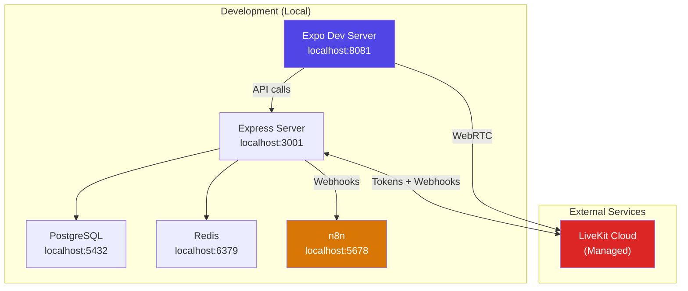

### Local Development Setup

| Service | How to Run | Port |
|:---|:---|:---|
| Express API | `npm run dev` (ts-node-dev / tsx) | 3001 |
| PostgreSQL | Docker: `docker run postgres:16` | 5432 |
| Redis | Docker: `docker run redis:7-alpine` | 6379 |
| n8n | Docker: `docker run n8nio/n8n` | 5678 |
| Expo | `npx expo start --dev-client` | 8081 |
| LiveKit | Cloud (no local setup needed) | — |

> [!NOTE]
> **LiveKit Webhooks in Development**
>
> LiveKit Cloud needs a public URL to send webhooks to our local server. We'll use `ngrok` or `cloudflared` to tunnel `localhost:3001` to a public URL, then configure that URL in LiveKit Cloud's webhook settings.

---

## 12. Phased Implementation Timeline (48 Hours)

### Phase 1: Core Streaming (Hours 0–24)

| Time Block | Task | Priority |
|:---|:---|:---|
| **H0–H2** | Project scaffolding: Expo app, Express server, Prisma schema, Docker Compose for PG/Redis | 🔴 Critical |
| **H2–H4** | Auth system: Register, Login, JWT middleware, Prisma User model | 🔴 Critical |
| **H4–H8** | Streaming core: LiveKit integration, token generation, room management, creator broadcast screen | 🔴 Critical |
| **H8–H12** | Viewer experience: Stream list, join stream, watch video, viewer count (Redis + Socket.IO) | 🔴 Critical |
| **H12–H16** | Chat system: Socket.IO setup, real-time messaging, message persistence, chat UI | 🔴 Critical |
| **H16–H20** | Polish Phase 1: Error handling, reconnection logic, basic UI styling, stream end flow | 🟡 Important |
| **H20–H24** | Testing + Buffer: Test all Phase 1 flows end-to-end, fix bugs, refine UI | 🟡 Important |

### Phase 2: Offline Support (Hours 24–36)

| Time Block | Task | Priority |
|:---|:---|:---|
| **H24–H28** | Offline queue: MMKV outbox, NetInfo listener, offline detection, message queueing | 🔴 Critical |
| **H28–H32** | Sync engine: FIFO processing, idempotency handling, `/api/chat/sync` endpoint, conflict resolution | 🔴 Critical |
| **H32–H36** | UI polish: Pending indicators, sync animations, error toasts, edge case handling | 🟡 Important |

### Phase 3: n8n Automation (Hours 36–46)

| Time Block | Task | Priority |
|:---|:---|:---|
| **H36–H38** | n8n setup: Docker container, webhook endpoints in Express, notification service | 🔴 Critical |
| **H38–H42** | Core workflows: Stream started → notify, Viewer milestone → alert, Stream ended → highlight | 🔴 Critical |
| **H42–H44** | Daily digest: Cron workflow, top streams aggregation | 🟢 Nice-to-have |
| **H44–H46** | Export workflows: JSON export for submission, documentation | 🟡 Important |

### Final Buffer (Hours 46–48)

| Time Block | Task | Priority |
|:---|:---|:---|
| **H46–H48** | README, cleanup, GitHub repo structure, final testing, submission | 🔴 Critical |

---

## 13. Risk Analysis & Mitigations

| Risk | Impact | Mitigation |
|:---|:---|:---|
| LiveKit Expo plugin incompatibility | 🔴 Blocks video | Test LiveKit + Expo dev build first (H0). Have fallback plan: bare React Native CLI. |
| Socket.IO + LiveKit dual connections drain mobile battery | 🟡 UX issue | Acceptable for MVP. In production, would optimize with connection pooling. |
| n8n Docker networking issues | 🟡 Blocks Phase 3 | Use `docker-compose` with shared network. Fallback: n8n Cloud free tier. |
| Offline sync race conditions | 🟡 Data issues | Sequential FIFO processing + idempotency keys. No parallel sync. |
| 48-hour time pressure | 🔴 Incomplete submission | Phases are prioritized. Phase 1 is the minimum viable submission. Phase 3 daily digest is explicitly "nice-to-have". |
| LiveKit Cloud free tier limits | 🟢 Low risk | 5,000 minutes is ~83 hours of streaming. More than enough for demo. |

---

## 14. Folder Structure (Preview)

> [!NOTE]
> This is a preview of the intended folder structure for orientation. Actual scaffolding happens during implementation.

```
buildai/
├── mobile/                    # React Native (Expo) app
│   ├── app/                   # Expo Router screens
│   ├── components/            # Reusable UI components
│   ├── hooks/                 # Custom hooks (useLiveKit, useChat, etc.)
│   ├── services/              # API client, Socket.IO client, offline queue
│   ├── stores/                # State management (Zustand recommended)
│   └── app.json               # Expo config with LiveKit plugin
│
├── backend/                   # Express.js + TypeScript
│   ├── src/
│   │   ├── routes/            # Express route handlers
│   │   ├── services/          # Business logic layer
│   │   ├── middleware/        # Auth, rate limiting, error handling
│   │   ├── socket/            # Socket.IO event handlers
│   │   ├── prisma/            # Prisma schema + migrations
│   │   └── config/            # Environment config
│   └── docker-compose.yml     # PostgreSQL + Redis + n8n
│
├── n8n-workflows/             # Exported n8n workflow JSONs
│   ├── stream-started.json
│   ├── viewer-milestone.json
│   ├── stream-ended.json
│   └── daily-digest.json
│
└── README.md
```

---

## Open Questions

> [!IMPORTANT]
> **Q1: State Management on Mobile**
>
> For the React Native app, do you prefer **Zustand** (lightweight, minimal boilerplate) or **React Context + useReducer** (no extra dependency)? I recommend Zustand — it's tiny (~1KB), works great with TypeScript, and handles the real-time state updates from Socket.IO cleanly.

> [!IMPORTANT]
> **Q2: Authentication Scope**
>
> The assignment doesn't specify authentication complexity. I'm planning **email + password with JWT** (simplest possible). No OAuth, no social login, no email verification. Is that acceptable, or do you want something more polished?

> [!IMPORTANT]
> **Q3: Push Notifications in n8n Workflows**
>
> The assignment says "notify followers" but doesn't specify the notification channel. For a 48-hour MVP, I'd **log notifications to console + store in DB** rather than integrating a real push notification service (which requires FCM/APNs setup, certificates, etc.). The n8n workflow would still be fully functional — just the final delivery step would be simulated. Thoughts?

> [!IMPORTANT]
> **Q4: Video Quality / Simulcast**
>
> LiveKit supports simulcast (multiple quality layers so viewers on poor connections get lower resolution). Should we enable this for the MVP, or keep it simple with a single video track? Simulcast adds ~3 lines of config but is a nice demo talking point.

> [!IMPORTANT]
> **Q5: Creator vs Viewer — Same App or Separate?**
>
> The assignment mentions "Creator App" and "Viewer App" but building two separate apps doubles the work. I'm planning a **single app with role-based UI** — any user can be both a creator and a viewer. The assignment seems to imply this too ("Creator (Mobile App)" and "Viewer (Mobile App)" likely refer to roles, not separate binaries). Confirm?

---

## Verification Plan

### Automated Tests
- **Backend**: Jest + Supertest for API route testing
- **Prisma**: Test migrations with `prisma migrate dev` 
- **Socket.IO**: Integration tests with `socket.io-client` in test harness

### Manual Verification
- End-to-end: Creator starts stream → Viewer joins → Chat works → Offline queue → Sync → Stream ends → n8n fires
- Test on physical device (Expo dev client build) for WebRTC performance
- Verify n8n workflows fire correctly via webhook test in n8n UI
- Test offline scenario: Enable airplane mode → send messages → disable → verify sync
